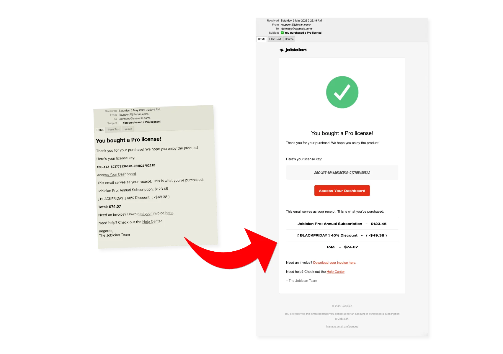

# 💌 Goodmail - Make your Rails SaaS transactional emails look beautiful
[](https://badge.fury.io/rb/goodmail)

Send beautiful, simple transactional emails with zero HTML hell.

Goodmail turns your ugly, default, text-only emails into SaaS-ready emails. It's an opinionated, minimal, expressive Ruby DSL for sending beautiful, production-grade transactional emails in Rails apps — no templates, no partials, no HTML hell. The template works well and looks nice across email clients.



Here's the catch: there's only one template. You can't change it. You're guaranteed you'll send good emails, but the cost is you don't have much flexibility. If you're okay with this, welcome to `goodmail`! You'll be shipping decent emails that look great everywhere in no time.

(And you can still use Action Mailer for all other template-intensive emails – Goodmail doesn't replace Action Mailer, just builds on top of it!)

## Installation

Add this line to your application's Gemfile:

```ruby
gem "goodmail"
```

And then execute:

```bash
bundle install
```

## Configuration

Goodmail requires minimal configuration to ensure emails look correct. You **must** set at least your `company_name`.

Create an initializer file at `config/initializers/goodmail.rb` and configure the options:

```ruby
# config/initializers/goodmail.rb

Goodmail.configure do |config|
  # --- Basic Branding (Required) --- 

  # The company name displayed in the email footer and used by `sign` helper.
  # NOT OPTIONAL - MUST BE SET
  config.company_name = "MyApp Inc."

  # --- Optional Branding --- 

  # The main accent color used for buttons and links in the email body.
  config.brand_color = "#E62F17"

  # Optional: URL to your company logo. If set, it will appear in the header.
  # Default: nil
  config.logo_url = "https://cdn.myapp.com/images/email_logo.png"

  # Optional: URL the header logo links to (e.g., your homepage).
  # Ignored if logo_url is not set. Must be a valid URL (no spaces etc.).
  # Default: nil
  config.company_url = "https://myapp.com"

  # --- Optional Email Content Defaults --- 

  # Optional: Default preheader text (appears after subject in inbox preview).
  # Can be overridden per email via headers[:preheader]. If unset, subject is used.
  # Default: nil
  config.default_preheader = "Your account update from MyApp."

  # Optional: Global default URL for unsubscribe links.
  # Goodmail *does not* handle the unsubscribe logic; you must provide a valid URL.
  # Can be overridden per email via headers[:unsubscribe_url].
  # Default: nil
  config.unsubscribe_url = "https://myapp.com/emails/unsubscribe"

  # --- Optional Footer Customization --- 

  # Optional: Custom text displayed in the footer below the copyright.
  # Use this to explain why the user received the email.
  # Default: nil
  config.footer_text = "You are receiving this email because you signed up for an account at MyApp."

  # Optional: Whether to show a visible unsubscribe link in the footer.
  # Requires an unsubscribe URL to be set (globally or per-email).
  # Default: false
  config.show_footer_unsubscribe_link = true

  # Optional: The text for the visible footer unsubscribe link.
  # Default: "Unsubscribe"
  config.footer_unsubscribe_link_text = "Click here to unsubscribe"
end
```

*The application will raise an error on startup if required configuration keys (`company_name`) are missing or blank.*

Make sure to restart your Rails server after creating or modifying the initializer.

## Quick start

Use the `Goodmail.compose` method to compose emails using the DSL, then call `.deliver_now` or `.deliver_later` on it.

### Basic Example (Deliver Now)

```ruby
# Assumes config/initializers/goodmail.rb is configured!
recipient = User.find(params[:user_id])

mail = Goodmail.compose(
  to: recipient.email,
  from: ""#{Goodmail.config.company_name} Support" <support@myapp.com>",
  subject: "Welcome to MyApp!",
  preheader: "Your adventure begins now!" # Optional override
) do
  h1 "Welcome aboard, #{recipient.name}!"
  text "We're thrilled to have you join the MyApp community."
  text "Here are a few things: Check the <a href=\"/help\">Help Center</a>."
  button "Go to Dashboard", user_dashboard_url(recipient)
  sign
end

mail.deliver_now
```

### Deliver Later (Background Job)

```ruby
mail = Goodmail.compose(
  to: @user.email,
  from: ..., # etc.
  subject: "Your password has been reset"
) do
  # ... DSL content ...
end

mail.deliver_later
```

*(Requires Active Job configured.)*

## Why does `goodmail` exist?

Here's the problem: you can't just use standard HTML and CSS in mails.

Emails are notoriously complicated to work with, because they're very difficult to style.

Modern CSS doesn't work in mails, because email clients render styles differently and some only support a primitive subset of HTML / CSS.

So, for example, you can't use stylesheets **at all**: all CSS needs to be inlined. You can't use many modern CSS properties either.

This is why many emails still use `<table>` elements, for example. It's the only way of making mails look good!

In fact, Mailgun released years ago [a few battle-tested HTML templates for emails](https://github.com/mailgun/transactional-email-templates). I took one of those email templates and have been using it in my projects for years.

So, can't this just be an Action Mailer `.erb` template instead?

I thought the same! And that's actually how I started using it. But after using it for years I realized I ended up building my own "proto-DSL" around it: I decomposed the email HTML template in partials, I was copying the same partials from project to project, etc. And setting up good emails in every new project took me a while because each project would have slight inconsistencies in the mail partials.

So making it into a gem with a simple DSL was my solution to solve this email HTML mess.

## Usage

### Available DSL Methods

Inside the `Goodmail.compose` block, you have access to these methods:

*   `h1(text)`, `h2(text)`, `h3(text)`: Styled heading tags.
*   `text(string)`: A paragraph of text. Allows simple inline `<a>` tags with `href` attributes; other HTML is stripped for safety. Handles `\n` for line breaks.
*   `button(link_text, url)`: A prominent, styled call-to-action button (includes Outlook VML fallback).
*   `image(src, alt = "", width: nil, height: nil)`: Embeds an image, centered by default (includes Outlook MSO fallback). Uses `config.company_name` for alt text if none provided.
*   `space(pixels = 16)`: Adds vertical whitespace.
*   `line`: Adds a horizontal rule (`<hr>`).
*   `center { ... }`: Centers the content generated within the block.
*   `code_box(text)`: Displays text centered and bold within a styled box (grey background, padding, italic). Text is HTML-escaped.
*   `price_row(name, price)`: Adds a styled paragraph showing a name and price, separated by a top border (e.g., for simple receipt line items). Text is HTML-escaped.
*   `sign(name = Goodmail.config.company_name)`: Adds a standard closing signature line.
*   `html(raw_html_string)`: **Use with extreme caution.** Allows embedding raw, *un-sanitized* HTML.

### Adding Unsubscribe Functionality

Goodmail helps you add the `List-Unsubscribe` header and an optional visible link, but **you must provide the actual URL** where users can unsubscribe.

1.  **Provide the URL:**
    *   **Globally:** Set `config.unsubscribe_url = "your_global_url"`.
    *   **Per-Email:** Pass `unsubscribe_url: "your_specific_url"` in the headers hash. This overrides the global setting.

    ```ruby
    mail = Goodmail.compose(
      to: recipient.email,
      unsubscribe_url: manage_subscription_url(recipient),
      # ... other headers ...
    ) do # ...
    ```
    *If an `unsubscribe_url` is provided, Goodmail adds the `List-Unsubscribe` header.*

2.  **Optionally Show Footer Link:**
    *   Set `config.show_footer_unsubscribe_link = true`.
    *   Customize `config.footer_unsubscribe_link_text`.
    *   *The footer link only appears if an `unsubscribe_url` was provided AND `config.show_footer_unsubscribe_link` is true.* 

    ```ruby
    # config/initializers/goodmail.rb
    Goodmail.configure do |config|
      config.unsubscribe_url = "https://myapp.com/preferences"
      config.show_footer_unsubscribe_link = true
      config.footer_unsubscribe_link_text = "Manage email preferences"
      # ...
    end
    ```

## Development

After checking out the repo, run `bin/setup` to install dependencies. Then, run `rake spec` to run the tests. You can also run `bin/console` for an interactive prompt that will allow you to experiment.

To install this gem onto your local machine, run `bundle exec rake install`.

## Contributing

Bug reports and pull requests are welcome on GitHub at https://github.com/rameerez/goodmail. Our code of conduct is: just be nice and make your mom proud of what you do and post online.

## License

The gem is available as open source under the terms of the [MIT License](https://opensource.org/licenses/MIT).