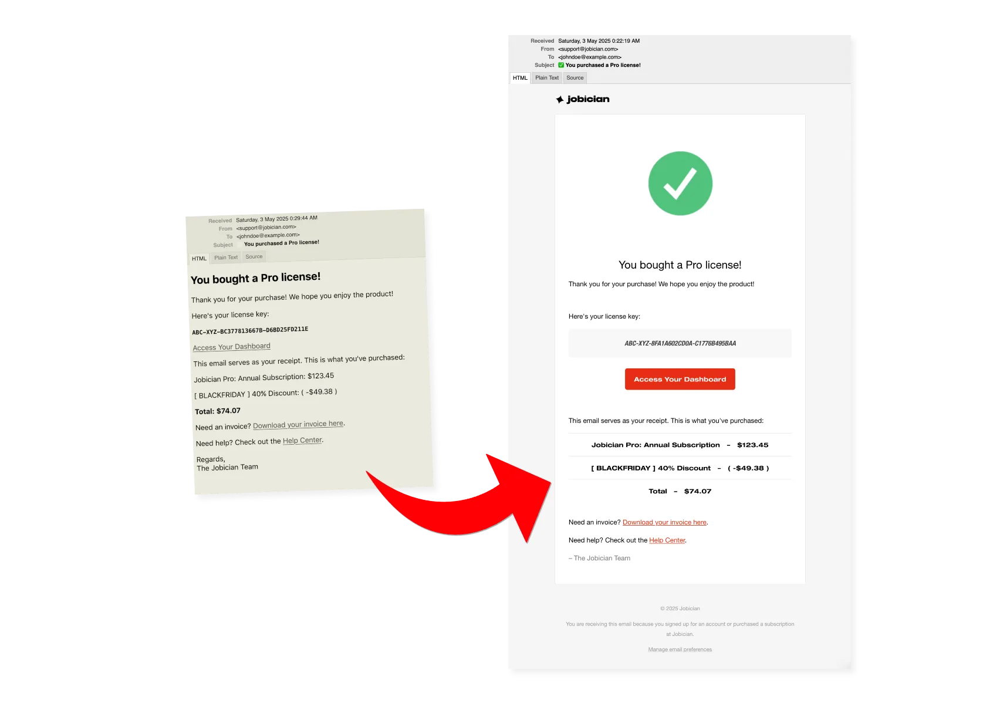

# 💌 Goodmail - Make your Rails SaaS transactional emails look beautiful
[](https://badge.fury.io/rb/goodmail)

Send beautiful, simple transactional emails with zero HTML hell.

Goodmail turns your ugly, default, text-only emails into SaaS-ready emails. It's an opinionated, minimal, expressive Ruby DSL for sending beautiful, production-grade transactional emails in Rails apps — no templates, no partials, no HTML hell. The template works well and looks nice across email clients.



You can easily add buttons, images, links, price lines, and text to your emails, and it'll look good everywhere, no styling needed.

Here's the catch: there's only one template. You can't change it. You're guaranteed you'll send good emails, but the cost is you don't have much flexibility. If you're okay with this, welcome to `goodmail`! You'll be shipping decent emails that look great everywhere in no time.

(And you can still use Action Mailer for all other template-intensive emails – Goodmail doesn't replace Action Mailer, just builds on top of it!)

## Installation

Add this line to your application's Gemfile:

```ruby
gem "goodmail"
```

And then execute:

```bash
bundle install
```

## Configuration

Goodmail requires minimal configuration to ensure emails look correct. You **must** set at least your `company_name`.

Create an initializer file at `config/initializers/goodmail.rb` and configure the options:

```ruby
# config/initializers/goodmail.rb

Goodmail.configure do |config|
  # --- Basic Branding (Required) --- 

  # The company name displayed in the email footer and used by `sign` helper.
  # NOT OPTIONAL - MUST BE SET
  config.company_name = "MyApp Inc."

  # --- Optional Branding --- 

  # The main accent color used for buttons and links in the email body.
  config.brand_color = "#E62F17"

  # Optional: URL to your company logo. If set, it will appear in the header.
  # Default: nil
  config.logo_url = "https://cdn.myapp.com/images/email_logo.png"

  # Optional: URL the header logo links to (e.g., your homepage).
  # Ignored if logo_url is not set. Must be a valid URL (no spaces etc.).
  # Default: nil
  config.company_url = "https://myapp.com"

  # --- Optional Email Content Defaults --- 

  # Optional: Default preheader text (appears after subject in inbox preview).
  # Can be overridden per email via headers[:preheader]. If unset, subject is used.
  # Default: nil
  config.default_preheader = "Your account update from MyApp."

  # Optional: Global default URL for unsubscribe links.
  # Goodmail *does not* handle the unsubscribe logic; you must provide a valid URL.
  # Can be overridden per email via headers[:unsubscribe_url].
  # Default: nil
  config.unsubscribe_url = "https://myapp.com/emails/unsubscribe"

  # --- Optional Footer Customization --- 

  # Optional: Custom text displayed in the footer below the copyright.
  # Use this to explain why the user received the email.
  # Default: nil
  config.footer_text = "You are receiving this email because you signed up for an account at MyApp."

  # Optional: Whether to show a visible unsubscribe link in the footer.
  # Requires an unsubscribe URL to be set (globally or per-email).
  # Default: false
  config.show_footer_unsubscribe_link = true

  # Optional: The text for the visible footer unsubscribe link.
  # Default: "Unsubscribe"
  config.footer_unsubscribe_link_text = "Click here to unsubscribe"
end
```

*The application will raise an error on startup if required configuration keys (`company_name`) are missing or blank.*

Make sure to restart your Rails server after creating or modifying the initializer.

## Quick start

Use the `Goodmail.compose` method to compose emails using the DSL, then call `.deliver_now` or `.deliver_later` on it.

### Basic Example (Deliver Now)

```ruby
# Assumes config/initializers/goodmail.rb is configured!
recipient = User.find(params[:user_id])

mail = Goodmail.compose(
  to: recipient.email,
  from: "'#{Goodmail.config.company_name} Support' <support@myapp.com>",
  subject: "Welcome to MyApp!",
  preheader: "Your adventure begins now!" # Optional override
) do
  h1 "Welcome aboard, #{recipient.name}!"
  text "We're thrilled to have you join the MyApp community."
  text "Here are a few things: Check the <a href=\"/help\">Help Center</a>."
  button "Go to Dashboard", user_dashboard_url(recipient)
  sign
end

mail.deliver_now
```

### Deliver Later (Background Job)

```ruby
mail = Goodmail.compose(
  to: @user.email,
  from: ..., # etc.
  subject: "Your password has been reset"
) do
  # ... DSL content ...
end

mail.deliver_later
```

*(Requires Active Job configured.)*

## Why does `goodmail` exist?

Here's the problem: you can't just use standard HTML and CSS in mails.

Emails are notoriously complicated to work with, because they're very difficult to style.

Modern CSS doesn't work in mails, because email clients render styles differently and some only support a primitive subset of HTML / CSS.

So, for example, you can't use stylesheets **at all**: all CSS needs to be inlined. You can't use many modern CSS properties either.

This is why many emails still use `<table>` elements, for example. It's the only way of making mails look good!

In fact, Mailgun released years ago [a few battle-tested HTML templates for emails](https://github.com/mailgun/transactional-email-templates). I took one of those email templates and have been using it in my projects for years.

So, can't this just be an Action Mailer `.erb` template instead?

I thought the same! And that's actually how I started using it. But after using it for years I realized I ended up building my own "proto-DSL" around it: I decomposed the email HTML template in partials, I was copying the same partials from project to project, etc. And setting up good emails in every new project took me a while because each project would have slight inconsistencies in the mail partials.

So making it into a gem with a simple DSL was my solution to solve this email HTML mess.

## Usage

### Available DSL Methods

Inside the `Goodmail.compose` block, you have access to these methods:

*   `h1(text)`, `h2(text)`, `h3(text)`: Styled heading tags.
*   `text(string)`: A paragraph of text. Allows simple inline `<a>` tags with `href` attributes; other HTML is stripped for safety. Handles `\n` for line breaks.
*   `link(link_text, url)`: An inline styled link, rendered in the configured `brand_color`. Cleaner than hand-writing `<a>` tags inside `text` blocks when the whole paragraph is the link.
*   `small(string)`: A small grey paragraph for fine print, legal disclaimers and "you are receiving this because…" footers.
*   `button(link_text, url)`: A prominent, styled call-to-action button (includes Outlook VML fallback).
*   `image(src, alt = "", width: nil, height: nil)`: Embeds an image, centered by default (includes Outlook MSO fallback). Uses `config.company_name` for alt text if none provided.
*   `attach(filename, content, mime_type: nil, inline: false)`: Attaches a binary file (PDF, .ics, .csv, image…) to the outgoing email. `content` can be raw bytes or a filesystem path — when the string matches an existing file it is read for you. Pass `inline: true` to send the part with `Content-Disposition: inline` so the body can reference it via `cid:FILENAME`.
*   `inline_image(filename, content, alt: "", width: nil, height: nil, mime_type: nil)`: Convenience helper that registers an inline-disposition attachment AND emits the matching `` tag at that point in the email body. Use when you need the image to travel with the email (no public hosting available, offline reading, etc.); when you already have a public URL prefer `image(src, alt)` — it's lighter on the wire.
*   `space(pixels = 16)`: Adds vertical whitespace.
*   `line`: Adds a horizontal rule (`<hr>`).
*   `center { ... }`: Centers the content generated within the block.
*   `code_box(text)`: Displays text centered and bold within a styled box (grey background, padding, italic). Text is HTML-escaped.
*   `price_row(name, price)`: Adds a styled paragraph showing a name and price, separated by a top border (e.g., for simple receipt line items). Both the name and the price render bold and centered — meant for cases where label and amount carry equal weight. Text is HTML-escaped.
*   `info_row(label, value)`: Adds a label/value row using the email-safe two-column table pattern (muted label on the left, dark right-aligned value on the right, 1px hairline at the bottom). Use this when the LABEL is supporting context and the VALUE is the primary content ("Distance — 18 km", "Driver — Lola Garcia"). Stack multiple consecutive `info_row` calls to build a clean info card. Text is HTML-escaped.
*   `sign(name = Goodmail.config.company_name)`: Adds a standard closing signature line.
*   `html(raw_html_string)`: **Use with extreme caution.** Allows embedding raw, *un-sanitized* HTML.

### Advanced: Rendering Email Parts with `Goodmail.render`

For more advanced use cases, such as integrating Goodmail's content generation into existing mailer workflows (like Devise mailers) or when you need direct access to the generated HTML and plain text parts before sending, Goodmail provides the `Goodmail.render` method.

This method processes your DSL block, applies the layout, runs Premailer for CSS inlining, and performs plain text cleanup, similar to `Goodmail.compose`. However, instead of returning a `Mail::Message` object ready for delivery, it returns a `Goodmail::EmailParts` struct.

The `Goodmail::EmailParts` struct (defined in `goodmail/email.rb`) has three attributes:
*   `html`: The final, inlined HTML content for your email.
*   `text`: The cleaned-up plain text version of your email.
*   `attachments`: An array of `{ filename:, content:, mime_type:, inline: }` hashes for every `attach` / `inline_image` call inside the DSL block. Empty array when the DSL didn't register any attachments. You're responsible for handing these to ActionMailer's `attachments` hash — see the example below.

**How to use it:**

You can then use these parts within any Action Mailer setup:

```ruby
# In your custom mailer (e.g., a Devise mailer override)

# Define your headers (to, from, subject, etc.)
# The :subject is crucial for Goodmail.render.
# You can also pass :unsubscribe_url and :preheader to Goodmail.render
# to override global configurations for that specific email.
# Note: these Goodmail-specific keys will be used by Goodmail.render
# and should not be passed directly to ActionMailer's mail() method
# if they are not standard mail headers.
mail_rendering_headers = {
  to: recipient.email,
  from: "notifications@myapp.com",
  subject: "Important Update for #{recipient.name}",
  unsubscribe_url: custom_unsubscribe_url_for_user(recipient), # Optional
  preheader: "A quick update you should see." # Optional
}

# Render the email parts using Goodmail's DSL
# Goodmail.render will use :subject, :unsubscribe_url, :preheader internally.
parts = Goodmail.render(mail_rendering_headers) do
  h1 "Hello, #{recipient.name}!"
  text "This is an important update regarding your account."
  button "View Details", view_details_url(recipient)
  sign "The MyApp Team"
end

# Prepare headers for ActionMailer's mail() method,
# ensuring only standard mail headers are passed.
action_mailer_headers = mail_rendering_headers.slice(:to, :from, :subject, :cc, :bcc, :reply_to)

# Hand any `attach` / `inline_image` parts off to ActionMailer's
# attachments hash. Two important points:
#   - `attachments.inline[]=` is the right setter for inline parts.
#   - For inline parts, pin the Content-ID to the filename so the
#     `` reference rendered into `parts.html`
#     by `inline_image` resolves to THIS part. Without this, Mail gem
#     auto-generates a globally-unique Content-ID and the image renders
#     as a broken icon. (The `Goodmail.compose` path handles this
#     automatically; the render path is up to you.)
parts.attachments.each do |attachment|
  target = attachment[:inline] ? attachments.inline : attachments
  payload = attachment[:mime_type] ? { mime_type: attachment[:mime_type], content: attachment[:content] } : attachment[:content]
  target[attachment[:filename]] = payload
  attachments[attachment[:filename]].content_id = "<#{attachment[:filename]}>" if attachment[:inline]
end

# Now use these parts in ActionMailer's mail method
# You might also want to add the List-Unsubscribe header manually here if needed.
final_mail_object = mail(action_mailer_headers) do |format|
  format.html { render html: parts.html.html_safe }
  format.text { render plain: parts.text }
end

# The `final_mail_object` returned by ActionMailer can then be delivered:
# final_mail_object.deliver_now or final_mail_object.deliver_later
```

**Key Differences from `Goodmail.compose`:**

*   **Return Value**: `Goodmail.render` returns an instance of `Goodmail::EmailParts` (e.g., `EmailParts.new(html: "...", text: "...")`). `Goodmail.compose` returns a `Mail::Message` object.
*   **Purpose**: `Goodmail.render` is primarily for generating and retrieving processed email content parts. `Goodmail.compose` is for generating a complete, deliverable `Mail::Message` object.
*   **List-Unsubscribe Headers**: `Goodmail.render` itself does *not* add the `List-Unsubscribe` or `List-Unsubscribe-Post` headers to any mail object (as it doesn't create one). If you use `Goodmail.render` you are responsible for adding both headers to your `Mail::Message` object when an `unsubscribe_url` was effectively used during rendering. Recommended snippet:

    ```ruby
    if (unsubscribe_url = mail_rendering_headers[:unsubscribe_url] || Goodmail.config.unsubscribe_url).present?
      action_mailer_headers["List-Unsubscribe"]      = "<#{unsubscribe_url}>"
      action_mailer_headers["List-Unsubscribe-Post"] = "List-Unsubscribe=One-Click"
    end
    ```

    The internal `Goodmail::Mailer` (used by `Goodmail.compose`) sets both headers automatically. Gmail's and Yahoo's [bulk-sender requirements](https://support.google.com/mail/answer/81126) treat the missing one-click pair as a spam signal — if you skip this on a production sender, expect mid-volume deliverability drops.
*   **Attachments + inline images**: `Goodmail.render` collects every `attach` / `inline_image` call into `parts.attachments`. The example above shows the canonical fan-out (including the Content-ID pin for inline images, which Mail gem auto-generates incorrectly otherwise). `Goodmail.compose` handles both for you.

### Integrating with the Pay Gem

Goodmail works seamlessly with the [Pay gem](https://github.com/pay-rails/pay) to send beautiful transactional emails for payment notifications (receipts, refunds, subscription updates, etc.).

Since Pay allows you to configure a custom mailer class, you can create a mailer that uses `Goodmail.render` to generate beautiful email content for all Pay notifications.

In the examples below, app-defined mailers that use Goodmail follow the `*Goodmailer` suffix convention. This is just a naming convention for clarity, not a requirement imposed by Goodmail itself.

**Quick Setup:**

1. Copy the example mailer from [`examples/pay_goodmailer.rb`](examples/pay_goodmailer.rb) to your Rails app at `app/mailers/pay_goodmailer.rb`

2. Configure Pay to use the custom mailer in `config/initializers/pay.rb`:

```ruby
Pay.setup do |config|
  config.parent_mailer = "ApplicationMailer"
  config.mailer = "PayGoodmailer"
  # ... other Pay configuration
end
```

3. Customize the email content and URLs in the mailer to match your app

The example implementation includes all Pay notification types:
- `receipt` - Payment receipts
- `refund` - Refund confirmations
- `subscription_renewing` - Renewal reminders
- `payment_action_required` - Payment action needed
- `subscription_trial_will_end` - Trial ending soon
- `subscription_trial_ended` - Trial has ended
- `payment_failed` - Failed payment alerts

Each method uses `Goodmail.render` to create beautiful, consistent emails that match your brand.

### Adding Unsubscribe Functionality

Goodmail helps you add the `List-Unsubscribe` header and an optional visible link, but **you must provide the actual URL** where users can unsubscribe.

1.  **Provide the URL:**
    *   **Globally:** Set `config.unsubscribe_url = "your_global_url"`.
    *   **Per-Email:** Pass `unsubscribe_url: "your_specific_url"` in the headers hash. This overrides the global setting.

    ```ruby
    mail = Goodmail.compose(
      to: recipient.email,
      unsubscribe_url: manage_subscription_url(recipient),
      # ... other headers ...
    ) do # ...
    ```
    *If an `unsubscribe_url` is provided, Goodmail adds both the `List-Unsubscribe` and the RFC 8058 `List-Unsubscribe-Post: List-Unsubscribe=One-Click` headers. Gmail's and Yahoo's [bulk-sender requirements](https://support.google.com/mail/answer/81126) (Feb 2024+) treat missing one-click unsubscribe as a spam signal — Goodmail handles this for you. Your URL just needs to accept the magic POST body `List-Unsubscribe=One-Click` (or, if you haven't built the endpoint yet, a plain GET still works as a fallback).*

2.  **Optionally Show Footer Link:**
    *   Set `config.show_footer_unsubscribe_link = true`.
    *   Customize `config.footer_unsubscribe_link_text`.
    *   *The footer link only appears if an `unsubscribe_url` was provided AND `config.show_footer_unsubscribe_link` is true.* 

    ```ruby
    # config/initializers/goodmail.rb
    Goodmail.configure do |config|
      config.unsubscribe_url = "https://myapp.com/preferences"
      config.show_footer_unsubscribe_link = true
      config.footer_unsubscribe_link_text = "Manage email preferences"
      # ...
    end
    ```

## Development

After checking out the repo, run `bin/setup` to install dependencies. Then, run `rake test` to run the test suite (Minitest 6+, no Rails app required — every code path is exercised in isolation through `Goodmail.compose` / `Goodmail.render`). You can also run `bin/console` for an interactive prompt that will allow you to experiment.

To check line coverage, run `COVERAGE=1 rake test` and open `coverage/index.html`. The suite ships with 100% line coverage as a baseline; if you add a method, add a test for it.

To install this gem onto your local machine, run `bundle exec rake install`.

## Contributing

Bug reports and pull requests are welcome on GitHub at https://github.com/rameerez/goodmail. Our code of conduct is: just be nice and make your mom proud of what you do and post online.

## License

The gem is available as open source under the terms of the [MIT License](https://opensource.org/licenses/MIT).
